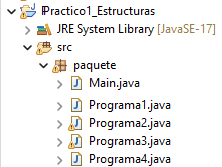
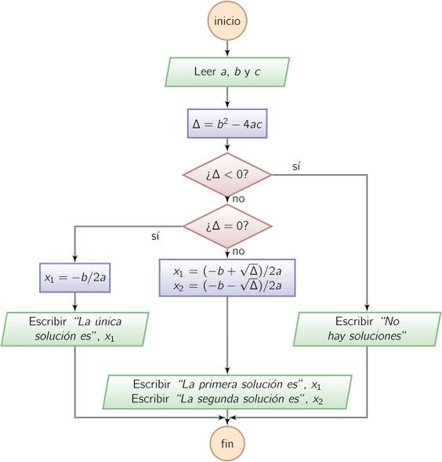

# Practico1: Estructuras de control y Métodos

## En Eclipse:

#### Realice un proyecto llamado **Practico1_Estructuras**
#### Agregue un paquete llamado *paquete*
#### Cree una clase llamada *Main* . Dejo su código  [aquí](src/paquete/Main.java) desde donde podra completar y ejecutar los  requerimientos de éste proyecto  
 
### IMPORTANTE:  En onlineGDB, no podemos crear paquetes, por lo tanto cuando suba sus archivos a onlineGDB deje comentada la primera línea de cada archivo (package paquete;)
-----------------------------------------------------------------------------------------------------------------------------------------------------------
## Ejercicio 1 (Scanner): En *paquete* crear:

#### - Una clase llamada *Programa1*, donde realice un programa que utilice métodos para **cargar**  e **imprimir** información sobre una persona: Apellido (String), edad (int), altura (double) y cédula (int). Dejo su código para completar   [aquí](src/paquete/Programa1.java)
 
## Ejercicio 2 (Random):  En *paquete* crear:

#### - Una clase llamada *Programa2*, donde realice un programa que genere un único número aleatorio entre el 1 y el 1000 (será fijo durante la ejecución) y el usuario ingresará un valor, se imprime en pantalla “Demasiado grande” si el número ingresado es más grande, y “Demasiado chico”, si el número ingresado es demasiado chico.El usuario deberá ingresar números hasta que coincida con el número aleatorio.El programa finalizará con el mensaje “Felicitaciones, acertó el número”.

Dejo su código para completar   [aquí](src/paquete/Programa2.java) 
	
## Ejercicio 3 (String):   En *paquete* crear:
#### - Una clase llamada *Programa3*, donde realice un programa que:

Cargue por teclado dos variables del tipo String y despliegue un menú con las opciones:

	1. Imprimir ambas cadenas y su largo.
	2. Comparar igualdad y quien es menor (en caso de ser cadenas distintas).
	3. Cambiar una cadena a todo mayúsculas y otra a todo minúsculas.
	4. Cargar nuevamente ambos String.
	0. Salir

Deberá investigar en la API de Java u otro sitio web acerca de los métodos de la clase String.
Dejo su código para completar   [aquí](src/paquete/Programa3.java)

## Ejercicio 4 (Math):   En *paquete* crear:
#### - Una clase llamada *Programa4*, donde realice un programa que:
•	Cargue a,b y c, tres variables del tipo double y

•	Despliegue un menú con:

		1. El cuadrado y la raíz cuadrada de cada valor  
		2. Bhaskara utilizando ax2+ bx + c.  (ax está al cuadrado, el 2 va arriba chiquito!!!)
  		3. El mayor de tres números, reutilizando el método que calcula el mayor de 2.
  		0. Salir
  
		Deberá investigar en la API de Java u otro sitio web acerca de los métodos de la clase Math.
  Dejo su código para completar   [aquí](src/paquete/Programa4.java)
  
  Para resolver Bhaskara tenga en cuenta el siguiente diagrama de flujo  
 

